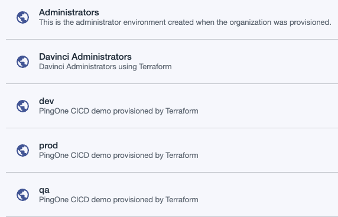
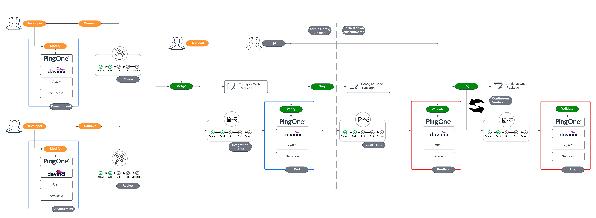
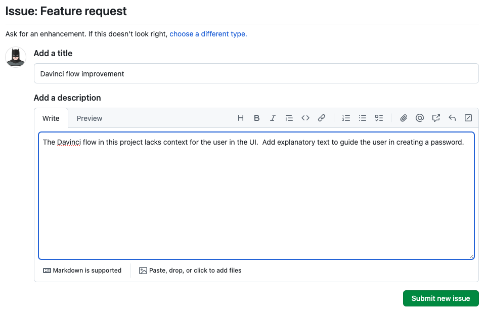
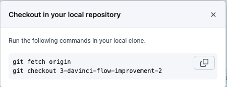

# Ping Application Example Pipeline

This repository is intended to present a simplified reference demonstrating how a management and deployment pipeline might work for applications that depend on services managed by a central IAM platform team. As such, it is a complement to the [infrastructure](https://github.com/pingidentity/pipeline-example-infrastructure) and [platform](https://github.com/pingidentity/pipeline-example-platform) example pipeline repositories.

> [!IMPORTANT]
> This repository directly depends on a completed setup of the [pipeline-example-platform](https://github.com/pingidentity/pipeline-example-platform?tab=readme-ov-file#deploy-prod-and-qa). Please ensure you have completed the steps for configuration leading up to and including the previous link, where a `prod` and `qa` environment have been deployed.

**Infrastructure** - Components dealing with deploying software onto self-managed Kubernetes infrastructure and any configuration that must be delivered directly via the filesystem.

**Platform** - Components dealing with deploying configuration to self-managed or hosted services that will be shared and leveraged by upstream applications.

**Application** - Delivery and configuration of a client application that relies on core services from Platform and Infrastructure.

The use cases and features shown in this repository are an implementation of the guidance provided from Ping Identity's [Terraform Best Practices](https://terraform.pingidentity.com/best-practices/) and [Getting Started with Configuration Promotion at Ping](https://terraform.pingidentity.com/getting-started/configuration-promotion/) documents.

In this repository, the processes and features shown in a GitOps process of developing and delivering a new application include:

- Feature Request Template
- Feature Development in an on-demand or persistent development environment
- Extracting feature configuration to be stored as code
- Validating the extracted configuration from the developer perspective
- Validating that the suggested configuration adheres to contribution guidelines
- Review process of suggested change
- Approval of change and automatic deployment into higher environments

## Prerequisites

To be successful in recreating the use cases supported by this pipeline, there are initial steps that should be completed prior to configuring this repository:

- Completion of all pre-requisites and configuration steps leading to [Feature Development](https://github.com/pingidentity/pipeline-example-platform?tab=readme-ov-file#feature-development) from the example-pipeline-platform repository
- [Docker](https://docs.docker.com/engine/install/) - used to deploy the UI for a sample interface
- [terraform](https://developer.hashicorp.com/terraform/install) - HashiCorp Terraform (version 1.9.8 was used in this guide)
- [opa](https://developer.hashicorp.com/terraform/tutorials/policy/sentinel-install) - Open Policy Agent for policy enforcement example (version 0.28.0 was used in this guide)
- [regal](https://github.com/StyraInc/regal) - for OPA policy syntax validation and linting (version 0.29.2 was used in this guide)
- [tflint](https://github.com/terraform-linters/tflint) - for Terraform linting (version 0.53.0 was used in this guide)
- [dvlint](https://github.com/pingidentity/dvlint) - for Davinci flow linting (version 1.0.3 was used in this guide)
- [trivy](https://github.com/aquasecurity/trivy) - for security scanning (version 0.56.2 was used in this guide)
- [shellcheck](https://github.com/koalaman/shellcheck?tab=readme-ov-file#installing) - for shell script linting (version 0.10.0 was used in this guide)
- [shfmt](https://github.com/mvdan/sh) - for shell script formatting (version 3.10.0 was used in this guide)
- [jq](https://jqlang.github.io/jq/download/) - for JSON parsing (version 1.7.1 was used in this guide)

> [!TIP]
> The last six tools are used by the pipeline in Github, and the pipeline will fail if these tests and configuration checks do not pass. Installing these tools locally and running `make devcheck` before committing changes should ensure that the pipeline will pass when changes are pushed. To explore policy enforcement with the `opa` and `regal` tools, see **Policies in CICD** under the ***Advanced Topics*** section at the end of this document.

<!-- TODO - Review Required Permissions-->
> [!IMPORTANT]
> For PingOne, meeting these requirements means you should have credentials for a worker app residing in the "Administrators" environment that has organization-level scoped roles. For DaVinci, you should have credentials for a user in a non-"Administrators" environment that is part of a group specifically intended to be used by command-line tools or APIs with environment-level scoped roles.

### Development Environment

If you have not created a static development environment in your PingOne account, you can do so in the local copy of the *pipeline-example-platform* repository by running the following commands to instantiate one matching prod and qa:

```bash
git checkout prod
git pull origin prod
git checkout -b dev
git push origin dev
```

Capture the environment ID for the development environment for use later.

> [!NOTE]
> The platform team may support ephemeral development environments rather than the static environment mentioned here. For purposes of this guide, we will assume that the development environment is shared and will be used by multiple developers.



### Repository Setup

Click the **Use this template** button at the top right of this page to create your own repository.  After the repository is created, clone it to your local machine to continue.  The rest of this guide will assume you are working from the root of the cloned repository.

> [!NOTE]
> A pipeline will run and fail when the repository is created. This result is expected as the pipeline is attempting to deploy the application and the necessary configuration has not yet been completed.

## Development Lifecycle Diagram

The use cases in this repository follow a flow similar to this diagram:



## Before You Start

There are a few items to configure before you can successfully use this repository.

### PingOne Environments

> [!IMPORTANT]
> The configurations in this sample repository rely on environments created from [pipeline-example-platform](https://github.com/pingidentity/pipeline-example-platform). For the `PINGONE_TARGET_ENVIRONMENT_ID_PROD` and `PINGONE_TARGET_ENVIRONMENT_ID_QA` variables needed down below, get the Environment ID for the `prod` and `qa` environments. The Environment ID can be found from the output at the end of a terraform apply (whether from the Github Actions pipeline, or local) or directly from the PingOne console.

### Github CLI

The Github cli: `gh` will need to be configured for your repository. Run the command **gh auth login** and follow the prompts.  You will need an access token for your Github account and the repository created from this template:

```bash
gh auth login

? What account do you want to log into? GitHub.com
? You're already logged into github.com. Do you want to re-authenticate? Yes
? What is your preferred protocol for Git operations? HTTPS
? Authenticate Git with your GitHub credentials? Yes
? How would you like to authenticate GitHub CLI? Paste an authentication token
Tip: you can generate a Personal Access Token here https://github.com/settings/tokens
The minimum required scopes are 'repo', 'read:org', 'workflow'.
? Paste your authentication token: ****************************************
- gh config set -h github.com git_protocol https
✓ Configured git protocol
✓ Logged in as <User>
```

### Github Actions Secrets

The Github pipeline actions depend on sourcing secrets as ephemeral environment variables. To prepare the secrets in the repository:

```bash
cp secretstemplate localsecrets
```

> [!CAUTION]
> `secretstemplate` is a template file while `localsecrets` contains credentials. `localsecrets` is part of *.gitignore* and should never be committed into the repository. **`secretstemplate`** is committed to the repository, so ensure that you do not edit it directly or you risk exposing your secrets.

Fill in `localsecrets` accordingly, referring to the comments in the file for guidance. Many of the values needed for this file can be found in the corresponding localsecrets file from the platform repository.

After updating the file, run the following commands to upload **localsecrets** to Github:

```bash
_secrets="$(/usr/bin/base64 -i localsecrets)"
gh secret set --app actions TERRAFORM_ENV_BASE64 --body $_secrets
unset _secrets
```

## Development Example Overview

To experience the developer's perspective, a walkthrough follows. The demonstration will simulate the use case of modifying a Davinci flow and promoting the change. To simplify the demonstration, a starting pre-configured flow will be created using Terraform.  The UI components will be built into a Docker image and launched on your local machine. After you have deployed the flow, you will be able to make the changes necessary in the PingOne UI, export the configuration, and promote the change to the QA and Prod environments.

## Feature Development

Now that the repository and pipeline are configured, the typical git flow can be followed. You will follow steps similar to those documented in the [pipeline-example-platform "Feature Development"](https://github.com/pingidentity/pipeline-example-platform/tree/prod?tab=readme-ov-file#feature-development) section.

A notable difference between this repository and the platform example is that the application pipeline does NOT deploy "development" feature configurations. Unlike QA and Prod, feature configuration *deployment* only takes place from the local machine and the development environment ID is not stored in the repository. In a following step when the `./scripts/local_feature_deploy.sh` script runs, you will be prompted for the environment ID.  

This deployment format accounts for static and ephemeral development environment setups, and further helps avoid the possibility that a developer changes a shared variable that impacts another engineer's work. For reliability, the developer must provide the environment ID for development and initial testing from the local machine, but the pipeline will handle deploying changes to QA and Prod, as those are common across teams and can be defined universally.

### Feature Development Walkthrough

1. To align with a typical developer experience, use the **Feature request** template in Github to create a GitHub Issue in the UI. GitHub Issue templates help ensure the requestor provides appropriate information on the issue. Provide a description and save the issue by clicking the "Submit New Issue" button.



2. Select the issue and click "Create a branch" and choose "Checkout Locally" from the right-hand navigation menu.


3. When you create the branch, you are provided the commands to check out the branch locally. Run the commands as instructed.  



4. Deploy the sample Davinci flow to the development environment by running the following commands. You will be prompted for the development environment ID:

```bash
source localsecrets
./scripts/local_feature_deploy.sh
```

> [!NOTE]
> If you want to see what Terraform will do without actually deploying, provide the `--dry-run` flag to the script. This flag generates the Terraform configuration without applying it by running `terraform plan`.

> [!NOTE]
> The `local_feature_deploy.sh` script will not run against the `prod` or `qa` branches.

5. Confirm the deployment by examining the Davinci flow in the PingOne console in the development environment matching the ID you provided. Click on the Davinci link from the PingOne console to open the DaVinci console and select **Flows** from the left navigation panel. Click on the **PingOne DaVinci Registration Example** flow to view the configuration.

6. The Terraform configuration also deployed a sample client application in a local docker container that can be used to try out the flow by navigating to [https://127.0.0.1:8443](https://127.0.0.1:8443). You will be presented a simple progressive profiling style form to enter an email address. If the email address is not found, you will be prompted to register the user.

> [!NOTE]
> For demo purposes, there is a self-signed certificate in the Docker image that will require you to accept the security warning in your browser to proceed.


7. On the next panel, you are told to provide the email and password. There are password rules in place, but you are not informed when prompted. Try using a simple password such as `password`. The form does not indicate there is a problem, but refuses to accept the password and continue.  The password must be at least 8 characters long and contain at least one uppercase letter, one lowercase letter, one number, and one special character.  

8. Create a valid password. After registering the user, you will be redirected to login.

9. To improve the flow, you will add a small prompt on the registration page to indicate that the password must meet the requirements.  To do so, select the **Registration Window** node in the Davinci flow editor. Replace the text in the HTML Template editor with the following code block. The only change from what is provided is the addition of the password requirements notification and some descriptive comments.

```html
<form id="registerForm">
    <p>We did not locate that account. Sign up now!</p>

    <!-- Email Input Field -->
    <input type="text" id="email" placeholder="Email address" required />

    <!-- Password Input Field -->
    <input type="password" id="password" placeholder="password" required />

    <!-- Password Requirement Text -->
    <small id="passwordRequirements" style="display: block; margin-top: 0.5rem; color: #6c757d;">
        Password must be at least 8 characters and contain 1 uppercase, 1 lowercase, 1 digit, and 1 symbol
    </small>

    <!-- Submit Button -->
    <button class="btn" data-skcomponent="skbutton" data-skbuttontype="form-submit" data-skform="registerForm" data-skbuttonvalue="submit">Register</button>
</form>
```

10. Click **Apply** to save the changes, then click **Deploy** to update the flow in the development environment.

11. Next, test your change from the client application.  Browse to [https://127.0.0.1:8443](https://127.0.0.1:8443) again and provide a new email address.  Notice on the registration page that you are presented the password requirements message.  Completing the new user registration is optional, as you can already see the change has been applied in the interface.

12. To capture the changes for inclusion in your code, export the flow. You can do so by selecting the three dots at the top right of the DaVinci flow editor UI and clicking **Download Flow JSON**. Ensure to select **Include Variable Values** when you export.


13. For the sake of brevity, assume that testing has been done, and you are ready to proceed. After the application is "tested", the new configuration must be added to the Terraform configuration. This addition will happen in a few steps:

  a. Copy the contents of the downloaded JSON file and use them to replace the `terraform/davinci-flows/davinci-widget-reg-authn-flow.json` file contents. If you examine the changes, you will see that it involves the company ID, metadata about the file and the changes you made to the node in the flow.

  b. Run the deploy script again:

```bash
source localsecrets
./scripts/local_feature_deploy.sh 
```

  c. If you examine the output, you will see that the change to the JSON object caused Terraform to detect a delta between the state stored in S3 (with the old JSON code) and what is present in the new code:
  
```bash
Terraform used the selected providers to generate the following execution plan. Resource actions are indicated with the
following symbols:
  ~ update in-place

Terraform will perform the following actions:

  # davinci_flow.registration_flow will be updated in-place
  ~ resource "davinci_flow" "registration_flow" {
      ~ flow_configuration_json = (sensitive value)
      ~ flow_export_json        = (sensitive value)
      ~ flow_json               = (sensitive value)
      id                      = "a6d551f1d7aa2612f2bf6c371b0026e1"
        name                    = "AppTeam PingOne DaVinci Registration Example"
        # (4 unchanged attributes hidden)

        # (3 unchanged blocks hidden)
    }

Plan: 0 to add, 1 to change, 0 to destroy.
```

  d. Applying the change will update and 'redeploy' the flow (even though it is exactly the same as what is there, the update to the file creates a delta for Terraform to resolve) and afterward, the state will reflect the new configuration. Type `yes` to apply the changes.

  e. Run the script again to confirm that the state matches the configuration:

```bash
No changes. Your infrastructure matches the configuration.
Terraform has compared your real infrastructure against your configuration and found no differences, so no changes are
needed.

Apply complete! Resources: 0 added, 0 changed, 0 destroyed.
```

14. If you want to go one step further, you can modify the HTML code that is placed in the nginx image. To do so, you can modify `./terraform/sample-app/index.html` in some manner.  When the script is ran again, it will detect the change to the file, rebuild the Docker image, and launch a replacement container for the UI.

15. Before committing and pushing the changes, run a devcheck against the code to ensure the formatting and syntax are correct, ignoring any warnings or informational messages:

```bash
make devcheck
```

16. Commit and push the changes to the repository:

```bash
git add .
git commit -m "Adding password requirements to registration page"
git push
```

17. The push will fire a pipeline that runs the same checks as you did locally. However, since this is a development branch, Terraform deployment will be skipped.

18. Create a pull request in the repository from your branch to `qa`.  Creation of the pull request will trigger a pipeline of checks and allow a "reviewer" to validate the changes. Merge the pull request to trigger the deployment workflow against the **qa** environment in your PingOne account.  You may choose to confirm the flow exists in your **qa** environment and has your change.

19. Finally, you can create a pull request from `qa` to `prod`.  Follow the same review process as for qa. Upon merge of the pull request, the pipeline will validate the changes and deploy the flow to the **prod** environment in your PingOne account.

## Cleanup

When you are finished with the demonstration, you can clean up the resources from the PingOne `dev` environment by running the following commands.  The `--destroy` flag will destroy the resources in the development environment:

```bash
source localsecrets
./scripts/local_feature_deploy.sh --destroy
```

After the development resources are destroyed:

- delete the branch from the local and remote repositories
- resolve the issue in the Github UI
- delete the feature folder from the `application-state/dev/` in the S3 bucket

## Conclusion

This repository demonstrates a simplified example of how a pipeline can be used to manage the development and deployment of an application that relies on services managed by a central IAM platform team. The pipeline is designed to be flexible and extensible, allowing for the addition of new features and services as needed. By following the steps outlined in this repository, you can gain a better understanding of how to implement a similar pipeline in your own environment.

## Advanced Topics

### Policies in CICD

While not a requirement for running a CICD pipeline, an emerging best practice for application and infrastructure automation is to include policy enforcement. One such tool in this area is the Open Policy Agent, or **opa**. This demonstration repository includes an example of the use of `opa` in a pipeline. The policy is defined in the `opa` directory.  When a pull request is opened against either the **qa** or **prod** branches, an additional step is included in the pipeline that will test the planned changes in the infrastructure against a sample policy that is provided for your exploration.

The files provided for deploying the application will pass the policy check as provided.  If you want to observe how the policies work, see the **Policy Enforcement** section below to interact with the policies using a local script.  As with the developer flow for working with Terraform, testing against any policies must be done locally prior to pushing changes to the repository.  Automating the policy checks on the development branch is not possible due to the need for manual input of the environment ID.

The example policy performs two checks against the Terraform plan:

- Ensure that the `name` attribute of any `davinci_flow` resource to be created or updated starts with the string `AppTeam`.  The example use case is our fictitious company wants the name of the team to be reflected in every flow name for easy identification.
- Ensure that the `deploy` flag is set to `true` for any `davinci_flow` resource to be created or updated.  The use case here is to ensure that all flows are deployed when they are created or updated.

> [!NOTE]
> Other policies may be added to this repository in the future. These policies are provided as examples to help you get started with policy enforcement in your own pipelines.

#### OPA Overview

As stated on their [website](https://www.openpolicyagent.org/), Open Policy Agent (OPA) *is an open source, general-purpose policy engine that unifies policy enforcement across the stack. OPA provides a high-level declarative language that lets you specify policy as code and simple APIs to offload policy decision-making from your software. You can use OPA to enforce policies in microservices, Kubernetes, CI/CD pipelines, API gateways, and more.*

OPA works by querying input, provided as JSON, against a policy written in the Rego language. The policy is a set of rules that define what is allowed or denied based on the input. Using the declarative language allows non-developers to create policies to meet their requirements.

For running OPA with terraform, the process is as follows:

- Policy files are written in the Rego language
- A `terraform plan` is generated and written to a file
- The plan output file is converted to json using `terraform show`
- The converted json output is passed to the `opa` command along with the policy files, where the planned changes are evaluated
- The `opa` command returns a pass or fail result based on the policy evaluation

#### Sample Policy Files

The files provided in this repository are arranged according to best practices for rego design, including the directory structure:

```bash
./opa
└── terraform
    ├── davinci
    │   ├── davinci_flow.rego
    │   └── davinci_flow_test.rego
    ├── flow_checks
    │   └── flow_checks.rego
    └── library
        ├── library.rego
        └── library_test.rego
```

The package names are reflected in the directory structure.  For example, the davinci_flow package name is `terraform.davinci`, matching the directory and subdirectory in which the file is located. The library files are common terraform routines that can be used across multiple policies.  The `flow_checks` directory contains functions written specifically to filter flows and perform generic policy rules evaluation. The `davinci` directory contains the specific implementation of the policies run against `davinci_flow` resources.  The files ending with `_test.rego` are used to validate policies against sample input.

An examination of the files will show that there is a hierarchy of imports.  The `library` files are imported by the `flow_checks` files, which are imported by the `davinci_flow` files.  This hierarchy allows for the reuse of common functions across multiple policies.

Further investigation of the files is recommended, but to emphasize the simplicity of the policy enforcement, the `davinci_flow.rego` file is provided below:

```bash
# DISCLAIMER: This file is intended for demonstration and example purposes only.
# It is provided "as is" without any warranties or guarantees of accuracy or fitness for use.
# Use at your own risk and adapt to your specific requirements before production use.

package terraform.davinci

import data.terraform.flow_checks
import rego.v1

resources := input.resource_changes # Explicitly access resources from input

# Retrieve all relevant flows with the "create" or "update" action
relevant_flows := flow_checks.relevant_flows(resources, ["create", "update"])

# Check if `deploy` is true for all relevant flows
deploy_true if {
	# print("Checking if deploy is true for all relevant flows:", relevant_flows) # Debugging output
	flow_checks.deploy_is_true_for_all(relevant_flows)
}

# Check if all flow names start with "AppTeam"
name_starts_with_appteam if {
	# print("Checking if all relevant flows start with 'AppTeam':", relevant_flows) # Debugging output
	flow_checks.name_starts_with_prefix(relevant_flows, "AppTeam")
}

# METADATA
# title: Davinci Flow "Master" rule set
# description: Determine if all 'davinci_flow' resources meet the required conditions.
# entrypoint: true
deny[msg] if {
	not deploy_true
	msg := "All 'davinci_flow' resources must have 'deploy' set to true."
	# print("Deny triggered for deploy:", msg)  # Debugging output
}

# Deny if any flow name does not start with "AppTeam"
deny[msg] if {
	not name_starts_with_appteam
	msg := "All 'davinci_flow' resources must have names starting with 'AppTeam'."
	# print("Deny triggered for name prefix:", msg)  # Debugging output
}
```

#### Policy Testing

To test the policies, a wrapper script is provided. "Testing" in this instance refers to validation that the rules are operating as expected.  To run the tests, execute the following command:

```bash
./scripts/policy_utils.sh
```

Output:

```bash
No options provided. Defaulting to running the sample OPA policy tests...
Use --help for more options.
Running tests...
PASS: 8/8
```

For a verbose output, pass in either the `--verbose` or `-v` flag:

```bash
./scripts/policy_utils.sh

+ shift
+ test -z ''
+ '[' true = true ']'
+ set -x
+ '[' false = false ']'
+ echo 'No options provided. Defaulting to running the sample OPA policy tests...'
No options provided. Defaulting to running the sample OPA policy tests...
+ echo 'Use --help for more options.'
Use --help for more options.
+ run_policy_tests
+ echo hxB
+ grep -q x
+ echo 'Running tests in verbose mode...'
Running tests in verbose mode...
+ cd opa
+ opa test -v -b .
terraform/davinci/davinci_flow_test.rego:
data.terraform.davinci_test.test_all_conditions_pass: PASS (2.067353ms)
data.terraform.davinci_test.test_deploy_fail: PASS (907.986µs)
data.terraform.davinci_test.test_name_prefix_fail: PASS (1.85553ms)

terraform/library/library_test.rego:
data.terraform.library_test.test_resources_by_type: PASS (356.852µs)
data.terraform.library_test.test_resources_by_action: PASS (370.007µs)
data.terraform.library_test.test_resources_by_type_and_action: PASS (374.088µs)
data.terraform.library_test.test_resource_by_name: PASS (292.253µs)
data.terraform.library_test.test_resource_by_type_and_name: PASS (320.96µs)
--------------------------------------------------------------------------------
PASS: 8/8
```

#### Policy Enforcement

To see the policy enforcement in action, a new DaVinci flow would need to be created, or an existing one modified.  As an example of a create, the following command was used.  The command generated a Terraform plan, converted it to JSON, and ran the policy checks against the plan.  If you want to run it on your own, you will have had to successfully run the `./scripts/local_feature_deploy.sh` script at least once to create a state file in the S3 bucket, and supply Terraform files to update or create the tested object. The state file is required to run `terraform plan` successfully.

```bash
./scripts/policy_utils.sh --plan-and-eval
```

Truncated output:

```bash
Initializing the backend...
Initializing modules...
Initializing provider plugins...

...

var.pingone_target_environment_id
  The target environment id to which to deploy the application

  Enter a value: <environment_id>


Terraform will perform the following actions:

...

  # davinci_flow.registration_flow will be created
  + resource "davinci_flow" "registration_flow" {
      + deploy                  = true
      + description             = "Imported on Tue May 16 2023 19:35:07 GMT+0000 (Coordinated Universal Time)"
      + environment_id          = "7b3378ed-3d11-4c67-95fe-8fc78eaa129b"
      + flow_configuration_json = (sensitive value)
      + flow_export_json        = (sensitive value)
      + flow_json               = (sensitive value)
      + flow_variables          = (known after apply)
      + id                      = (known after apply)
      + name                    = "AppTeam PingOne DaVinci Registration Example"


...

##################################################
Running OPA policy evaluation...


Policy Passed: No deny messages found.
```

Notice the name of the flow and the deploy flag.  The policy check passed because the name started with `AppTeam` and the deploy flag was set to `true`.

In the case of a failed test against the policy, the output will indicate the failure and the reason for the failure. In the pipeline, it creates a failure to stop deployment. To see this in action, the **./opa/plan.json** file resource_changes block was modified. The davinci_flow resource `deploy` flag was set to `false`, and the name of the flow changed from "AppTeam PingOne DaVinci Registration Example" to "xxxAppTeam PingOne DaVinci Registration Example". Running the script again with the appropriate flag to only perform the evaluation step resulted in the following:

```bash
./scripts/policy_utils.sh --eval-only
```

Output:

```bash
##################################################
Running OPA policy evaluation...


Policy Failed: Deny messages found.
Deny messages:
{
  "All 'davinci_flow' resources must have 'deploy' set to true.": true,
  "All 'davinci_flow' resources must have names starting with 'AppTeam'.": true
}
```

#### Policy Linting

The sample policies were linted using the `regal` utility.  Linting is a best practice that ensures that all developers are creating files that meet a known standard.  If you are going to be developing policies, it is recommended that to lint the files before committing them to the repository.  To lint the files, run the following command:

```bash
regal lint ./opa
```

For more information on the `regal` utility, see the link referenced in the prerequisites section.
